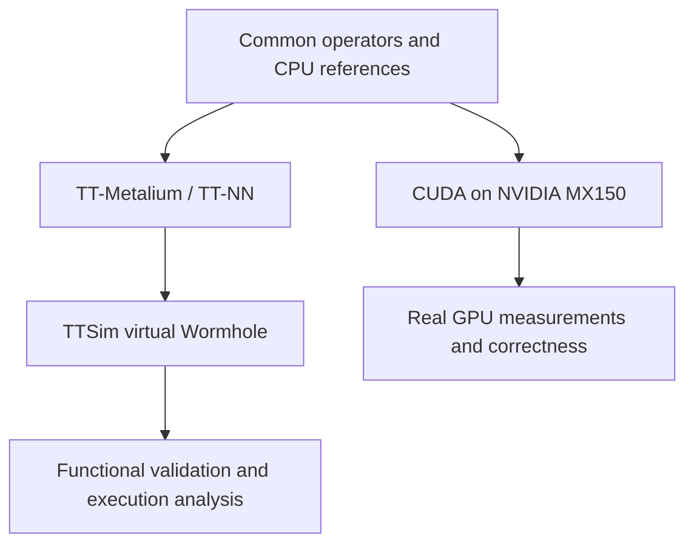

# 90. Architecture — 참고 문서

[진행 순서와 문서 안내](README.md)

```mermaid
flowchart TD
    A[Common operators and CPU references] --> B[CUDA on NVIDIA MX150]
    A --> C[TT-Metalium / TT-NN]
    C --> D[TTSim virtual Wormhole]
    B --> E[Real GPU measurements and correctness]
    D --> F[Functional validation and execution analysis]
```

Only Phase 0 is active. Operator implementations and models are future work.
